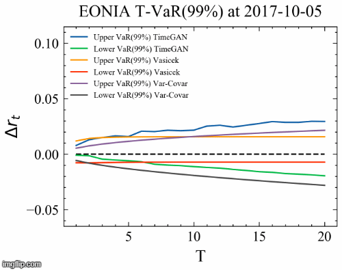
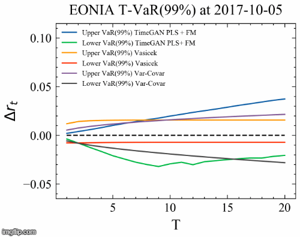
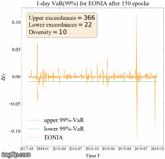
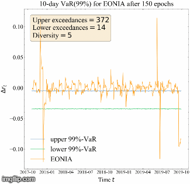
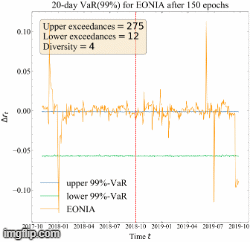

# TimeGAN for short rates

Welcome to my MSc Thesis titled "Interest rate risk simulation using TimeGAN after EONIA-€STER transition using a macro-finance temporal and latent representation based Generative Adversarial Network" for completion of the MSc Quantitative Finance at the Erasmus University Rotterdam. In this study, I simulate 1-day, 10-day, and 20-day short rate paths for EONIA using the TimeGAN model. Next to that, I evaluate the ECB's mapping of EONIA to €STER and check the applicability of TimeGAN for interest rate simulation of €STER, i.e. after the EONIA-€STER transition.

## Table of contents
* [Results](#results)
* [Reproducing paper](#reproducing-paper)
* [Web application](#web-application)
* [Getting started](#getting-started)
* [Technologies](#technologies)
* [Inspiration](#inspiration)

## Results

###### T-VaR(99%) estimate for regular TimeGAN (left) and TimeGAN with PLS+FM (right) during the validation dataset.

 

###### 1-day, 10-day, and 20-day VaR(99%) estimates for TimeGAN with PLS+FM during validation and test dataset.

  

## Reproducing paper

* 4 Training TimeGAN
  * For **CPU** version of TimeGAN, see tgan.py  
  * For **Multi-GPU** version of TimeGAN, see LISA/tgan.py 
* 5 Data 
  * To produce Figure 5 until 9, see plotting.py  
  * To produce Table 3, see stylized_facts.py
* 7.1 Model selection
  * To produce Figure 11 until 14, see autoencoder_training.py and hyper_and_importance.py
* 7.2 Coverage test
  * To produce Table 4, see TimeGAN_kupiec.py, kalman_filter_vasicek.py, and variance_covariance.py 
* 7.3 Diversity of simulations
  * To produce Figure 22 and 23, see TimeGAN_kupiec.py
  * To produce Figures 24, 36 until 43 see main.py
* 7.4 ECB's proposed mapping
  * To produce Figures 26 until 28, see metrics.py, stylized_facts.py and main.py

## Web application

Would like to see how the model works? This [web application](https://timegan-short-rates.herokuapp.com/) shows the influence of different hyperparameters and allows you to generate your own EONIA or €STER simulations. **Note that it is still under construction**

## Getting started

To train the TimeGAN model on EONIA data, install the folder locally using npm and run tgan.py:

```
$ cd ../TimeGAN-short-rates
$ npm install tgan.py
$ python tgan.py
>> [step: 1, g_loss_u_e: 0.018, g_loss_s: 0.023, g_loss_s_embedder: 0.021, e_loss_t0: 0.312, d_loss: 0.014]
>> [step: 2, g_loss_u_e: 0.019, g_loss_s: 0.022, g_loss_s_embedder: 0.031, e_loss_t0: 0.314, d_loss: 0.029]
...
```

## Technologies

Project is created with:
* Tensorflow version: 2.2
* Python version: 3.6.0
* Tensorboard version: 2.2
* Plotly Dash 3.7

## Inspiration

This MSc Thesis is inspired on TimeGAN by [@jsyoon0823](https://github.com/jsyoon0823/TimeGAN)
