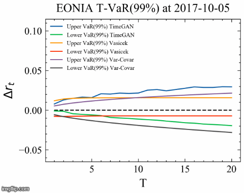

TimeGAN for short rates - Lars ter Braak - MSc Thesis Quantitative Finance

Here you see the GIF for the T-VaR(99%) estimate for regular TimeGAN:

Here you see the GIF for the T-VaR(99%) estimate for TimeGAN with Feature Matching + Positive Label Smoothing:

