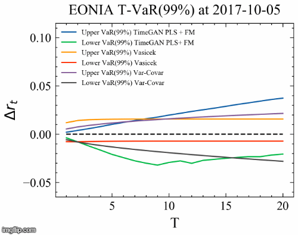
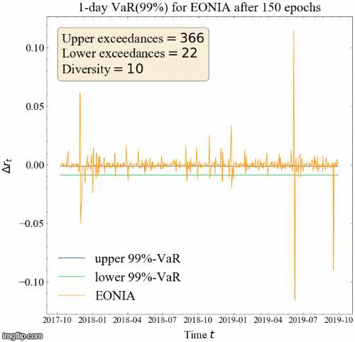
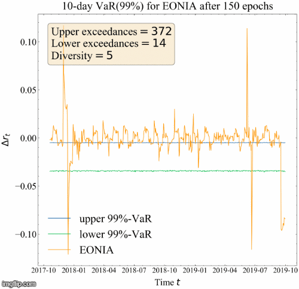
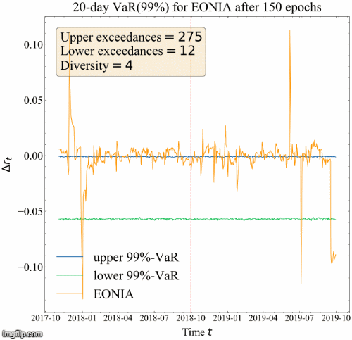

TimeGAN for short rates - Lars ter Braak - MSc Thesis Quantitative Finance

Here you see the GIF for the T-VaR(99%) estimate for regular TimeGAN:

Here you see the GIF for the T-VaR(99%) estimate for TimeGAN with Feature Matching + Positive Label Smoothing:

Here you see the visualizations of 1-day, 10-day, and 20-day VaR(99%) estimates for TimeGAN with Feature Matching + Positive Label smoothing during the validation and test dataset. The upper and lower exceedances and the diversity are based on the combination of the validation and test dataset.

