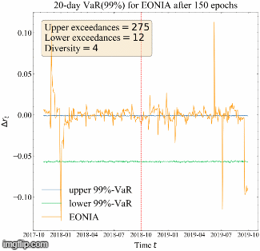

## Table of contents
* [General info](#general-info)
* [Results](#results)
* [Web application](#web-application)
* [Reproducing paper](#reproducing-paper)
* [Technologies](#technologies)
* [Getting started](#getting-started)
* [Inspiration](#inspiration)

## General info

MSc Thesis [Interest rate risk simulation using TimeGAN after EONIA-€STER transition using a macro-finance temporal and latent representation based Generative Adversarial Network][Thesis_v1.0.pdf] for completion of the MSc Quantitative Finance. In this study, I try to simulate short rate paths for the EONIA and based on the Discriminator in the TimeGAN evaluate the ECB's mapping of EONIA to €STER.

## Results

###### T-VaR(99%) estimate for regular TimeGAN (left) and TimeGAN with PLS+FM (right) during the validation dataset

 

###### 1-day, 10-day, and 20-day VaR(99%) estimates for TimeGAN with PLS+FM during validation and test dataset.

  

## Web application

I made a [web application](https://timegan-short-rates.herokuapp.com/) for the Thesis. Here you can check out the influence of different hyperparameters and generate your own EONIA or €STER simulations. **Note that it is still under construction**

## Reproducing paper

* 4.0 Training TimeGAN
  * For **CPU** version of TimeGAN, see tgan.py  
  * For **Multi-GPU** version of TimeGAN, see LISA/tgan.py 
* 5.0 Data 
  * To produce Figure 5 until 9, see plotting.py  
  * To produce Table 3, see stylized_facts.py
* 7.1 Model selection
  * To produce Figure 11 until 14, see autoencoder_training.py and hyper_and_importance.py
* 7.2 Coverage test
  * To produce Table 4, see TimeGAN_kupiec.py, kalman_filter_vasicek.py, and variance_covariance.py 
* 7.3 Diversity of simulations
  * To produce Figure 22 and 23, see TimeGAN_kupiec.py
  * To produce Figures 24, 36 until 43 see main.py
* 7.4 ECB's proposed mapping
  * To produce Figures 26 until 28, see metrics.py, stylized_facts.py and main.py

## Technologies

Project is created with:
* Tensorflow version: 2.2
* Python version: 3.6.0
* Tensorboard version: 2.2
* Plotly Dash 3.7

## Getting started

To run this project, install it locally using npm:

```
$ cd ../TimeGAN
$ npm install tgan.py
$ python tgan.py
[g_loss_u_e: 0.018, g_loss_s: 0.023, g_loss_s_embedder: 0.021, e_loss_t0: 0.312, d_loss: 0.014]
```

## Inspiration

This MSc Thesis is inspired on TimeGAN by [@jsyoon0823](https://github.com/jsyoon0823/TimeGAN)
